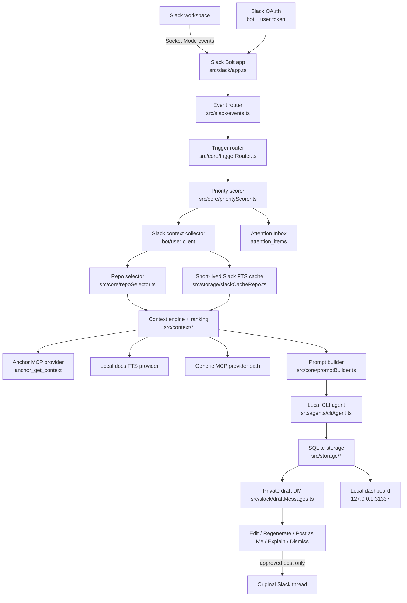

# SignalDesk Architecture

SignalDesk is a local-first Slack coworker assistant. Slack delivers events to a local daemon over Socket Mode. The daemon gathers Slack, repository PR history, and local docs evidence, runs a configured CLI agent, and sends a private draft DM. It never posts publicly unless the user clicks `Post as Me`.

## System Shape



## Core Invariants

- SignalDesk is a coworker assistant, not an autonomous Slack bot.
- Public posting is impossible from event handling.
- `chat.postMessage` to the original thread only happens inside the explicit `Post as Me` action path.
- User-token posting is preferred after OAuth; bot-token posting is only a fallback when user-token posting is unavailable.
- Slack messages, repository history, and MCP output are treated as untrusted context.
- Agents receive JSON over stdin and only an allowlisted environment.
- If Anchor, MCP, or the agent fails, SignalDesk still produces a draft with explicit assumptions.

## Main Components

| Area | Files | Responsibility |
| --- | --- | --- |
| Runtime | `src/index.ts`, `src/cli/signald.ts` | Start the local daemon. |
| CLI | `src/cli/sig.ts`, `src/cli/*Ops.ts` | Setup, doctor, run, service, repos, docs, tools, audit, config, Anchor, MCP helpers. |
| Config | `src/config/*` | YAML loading, path expansion, safety validation. |
| Slack | `src/slack/*` | Bolt setup, event registration, action handlers, draft DM blocks, Slack context collection. |
| Context | `src/context/*` | Provider SDK, evidence model, local docs indexing, evidence ranking. |
| Core | `src/core/*` | Trigger detection, priority scoring, repo selection, prompt building, draft orchestration. |
| Dashboard | `src/dashboard/*` | Local setup/status/inbox/drafts/audit UI and JSON APIs. |
| Anchor | `src/anchor/*` | Run Anchor indexing commands and call Anchor's MCP tools. |
| MCP | `src/mcp/*` | Generic stdio MCP client and registry for read-only local tools. |
| Agents | `src/agents/*` | Select and run configured CLI agents. |
| Storage | `src/storage/*` | SQLite tables and FTS indexes for events, drafts, audit logs, Slack cache, provider metadata, local docs. |

## Event Lifecycle

1. Slack sends an `app_mention` or `message` event over Socket Mode.
2. SignalDesk ignores bot/self messages and dedupes by `event_id` or `channel:ts`.
3. `triggerRouter` decides whether the event is relevant.
4. `priorityScorer` returns `critical`, `high`, `medium`, `low`, or `ignore`.
5. Ignore items stop before draft generation.
6. Relevant non-ignore items create or update an Attention Inbox item.
7. Low-priority items can be batched into the inbox without immediate DM interruption.
8. `contextCollector` fetches thread replies and permalink when available.
9. `repoSelector` chooses repositories by channel or keyword.
10. `ContextEngine` gathers evidence from Slack thread/history/search, short-lived Slack cache, Anchor, and local docs.
11. Evidence is ranked by trust, source, lexical match, repo/channel match, and prompt budget.
12. `promptBuilder` creates the strict JSON prompt contract with a `context_bundle`.
13. `CliAgent` runs the configured local command with JSON stdin.
14. The draft is stored in SQLite, linked to the inbox item, and sent to the user by private DM.
15. Slack action buttons update, explain, dismiss, or post the draft after approval.

## Local Dashboard

`signald` serves a local dashboard on `dashboard.host:dashboard.port`, defaulting to `http://127.0.0.1:31337`.

Dashboard APIs:

- `GET /api/status`: sanitized config summary plus Slack/daemon status.
- `GET /api/inbox`: current attention items.
- `GET /api/drafts`: recent drafts.
- `GET /api/audit`: recent audit rows.
- `POST /api/inbox/:id/dismiss` and `/snooze`: local inbox actions.
- `POST /api/watch` and `/api/watch/:id/stop`: local watched-thread controls.

The dashboard does not return Slack tokens, npm tokens, agent environment, or raw credential files.

## Posting Model

Draft creation and posting are separate code paths.

- Draft creation: `DraftService.handleEvent(...)`
- Public posting: `DraftService.postDraft(...)`, using the Slack user client when available
- Slack action entrypoint: `handlePostAction(...)`

Tests enforce that event handling only sends a private DM and never posts to the original channel.

## Storage

SignalDesk uses local SQLite through Node's `node:sqlite`.

Tables:

- `events`: event identity and raw event JSON for dedupe/audit.
- `drafts`: draft text, status, selected repos, selected agent, prompt hash, timestamps.
- `attention_items`: private attention inbox items linked to Slack events and drafts.
- `watched_threads`: Slack threads the user asked SignalDesk to monitor.
- `style_hints`: local style notes derived from draft edits without storing raw edit diffs.
- `schema_migrations`: local DB migration markers.
- `audit_logs`: local audit trail for ignored events, prompt decisions, DMs, edits, posting, and dismissals.
- `provider_metadata`: provider health/status metadata.
- `slack_messages` + `slack_messages_fts`: short-lived Slack context cache with TTL.
- `local_docs` + `local_docs_fts`: local docs evidence index.

Default database path:

```bash
.signald.sqlite
```

Override with:

```bash
SIGNALD_DB_PATH=/path/to/signald.sqlite
```

## Security Boundaries

SignalDesk keeps these boundaries explicit:

- Slack app token stays in environment variables.
- Slack bot and user tokens can come from `sig slack login`, stored in macOS Keychain first with a `0600` local fallback.
- Slack OAuth does not replace `SLACK_APP_TOKEN`; Socket Mode still needs an app-level token.
- CLI agents do not receive the full process environment.
- MCP tools receive only configured `env_allowlist` variables.
- Generic MCP tools are configured as `local_only: true` and `read_only: true`.
- Agent file writes are blocked by config validation.
- Public posting requires `security.require_approval_before_posting: true`.
